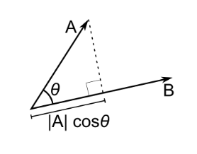

# The Mathematical Intuition Behind Deep Learning

Alex Punnen \
&copy; All Rights Reserved 

---

[Contents](index.md)

Even the most complex Neural network is based on vectors and matrices, and it uses the concept of a cost function and algorithms like gradient descent to find a reduced cost. Then, it propagates the cost back to all constituents of the network proportionally via a method called back-propagation.

Have you ever held an integrated circuit or chip in your hand or seen one? It looks overwhelmingly complex. But its base is the humble transistor and Boolean logic. To understand something complex, we need to understand the simpler constituents.

---

##  The Magic of Representation - Vector Space and Hyperplane

Most people are familiar with neural networks, cost functions, gradient descent, and backpropagation. However, beyond these building blocks is the magic of representations. 

Features live in a multidimensional universe where the concept of a **hyperplane** classifies or clusters similar features together. 

This idea applies equally to the simplest neural networks and to modern architectures such as Transformers.

One of the earliest neural networks, **Rosenblatt’s Perceptron**, introduced the idea of representing inputs as **vectors** and using the **dot product** to define a decision boundary — a hyperplane that separates input feature vectors.

First a short refresher.

### Vectors

A vector is an object that has both a magnitude and a direction. Example Force and Velocity. Both have magnitude as well as direction.

However we need to specify also a context where this vector lives -[Vector Space][1]. For example when we are thinking about something like [Force vector][2], the context is usually 2D or 3D Euclidean world.

(Source: 3Blue1Brown)

The easiest way to understand the Vector is in such a geometric context, say 2D or 3D cartesian coordinates, and then extrapolate it for other Vector spaces which we encounter but cannot really imagine.

### Matrices - A way to represent Vectors (and Tensors)

 Vectors are represented as matrices. A Vector is a one dimensional matrix.A matrix is defined to be a rectangular array of numbers. Example here is a [Euclidean Vector][Euclidean_vector]  in three-dimensional Euclidean space (or $R^{3}$) with some magnitude and direction (from (0,0,0) origin in this case).
 
 A vector is represented either as column matrix (m*1)or as a row matrix (1*m).

$$
a = \begin{bmatrix}
a_{1}\\a_{2}\\a_{3}\ 
\end{bmatrix} = \begin{bmatrix} a_{1} & a_{2} &a_{3}\end{bmatrix}
$$

$a_{1},a_{2},a_{3}$ are the component scalars of the vector. A vector is represented as $\vec a$ in the **Vector notation** and as $a_{i}$ in the **Index Notation**. 

### Two dimensional matrices can be thought of as one dimensional vectors stacked on top of each other. 

This intuition is especially helpful when we use dot products on neural network weight matrices.

### Dot product

This is a very important concept in linear algebra and is used in many places in machine learning.

**Algebraically**, the dot product is the sum of the products of the corresponding entries of the two sequences of numbers.

if $\vec a = \left\langle {a_1,a_2,a_3} \right\rangle$ and $\vec b = \left\langle {b_1,b_2,b_3} \right\rangle$, then 

$\vec a \cdot \vec b = {a_1}{b_1} + {a_2}{b_2} + {a_3}{b_3} = a_ib_i \quad\text {in index notation}$

In Matrix notation, 

$$
\vec a \cdot \vec b = \begin{bmatrix} a_{1} & a_{2} &a_{3}\end{bmatrix} \begin{bmatrix} b_{1}\\b_{2}\\b_{3}\end{bmatrix} = a_ib_i 
$$

**Geometrically**, it is the product of the Euclidean magnitudes of the two vectors and the cosine of the angle between them

$$
 \vec a \cdot \vec b = \left\| {\vec a} \right\|\,\,\left\| {\vec b} \right\|\cos \theta 
$$

 

Note- These definitions are equivalent when using Cartesian coordinates (Ref [8], [9])

### Transpose

The transpose of a matrix is an operator which flips a matrix over its diagonal; that is, it switches the row and column indices of the matrix A by producing another matrix, often denoted by $A^T$.

**This is important because the dot product of two vectors can be written as the matrix product of a row vector and a column vector:
$\vec a \cdot \vec b = a^T b$**

## Dot Product for checking Vector Alignment

If two vectors point in roughly the same direction, their dot product is positive. If they point in opposite directions, the dot product is negative.

This simple geometric fact becomes a powerful computational tool.

Imagine a problem where we want to classify whether a leaf is healthy or diseased based on certain features. Each leaf is represented as a feature vector in a two-dimensional space (for simplicity).

If we can find a weight vector such that:

Its dot product with healthy leaf vectors is positive

Its dot product with diseased leaf vectors is negative

then that weight vector defines a hyperplane that splits the feature space into two regions.

This is exactly how the Perceptron performs classification.

Imagine we have a problem of  classifying if a leaf is healthy or not based on certain features of the leaf. For each leaf we have some feature vector set assume it is a 2D vector space with say color as the feature for simplicity.

 For any  **input feature vector** in that vector space, if we have a **weight vector**, whose dot product with one feature vector of the set of input vectors of a certain class (say leaf is healthy) is positive, and with the other set is negative, then that weight vector is splitting the feature vector hyper-plane into two.

Or in a better way, which shows the vectors properly
 
 ![weightvector][weightvector]
 
 **In essence, we are using the weight vectors to split the hyper-plane into two distinctive sets.**

 For any new leaf, if we only extract the same features into a feature vector; we can *dot product* it with the *trained* weight vector and find out if it falls in healthy or deceased class.

 Here is a Colab notebook to play around with this.[14]

### Perceptron Learning Rule- Intuition: Nudging the Vector

Imagine the weight vector $w$ as a pointer. We want this pointer to be oriented such that:
1.  It points generally in the same direction as **Positive** examples.
2.  It points away from **Negative** examples.

We start with a random weight vector. Then, we iterate through our training data and check how the current $w$ classifies each point.

*   **If the classification is correct**: We do nothing. The weight vector is already doing its job for this point.
*   **If the classification is wrong**: We need to "nudge" or rotate the weight vector to correct the error.

### The Update Rules

Let's say we have an input vector $x$.

**Case 1: False Negative**
The input $x$ is a **Positive** example ($y=1$), but our current $w$ classified it as negative (dot product $w \cdot x < 0$).
*   **Action**: We need to rotate $w$ *towards* $x$.
*   **Update**: $w_{new} = w_{old} + x$
*   **Result**: Adding $x$ to $w$ makes the new vector more aligned with $x$, increasing the dot product for the next time.

**Case 2: False Positive**
The input $x$ is a **Negative** example ($y=0$ or $-1$), but our current $w$ classified it as positive (dot product $w \cdot x > 0$).
*   **Action**: We need to rotate $w$ *away* from $x$.
*   **Update**: $w_{new} = w_{old} - x$
*   **Result**: Subtracting $x$ from $w$ pushes it in the opposite direction, decreasing the dot product.

We can combine these rules into a single update equation. We often introduce a **learning rate** $\eta$ (a small number like 0.1) to make the updates smoother, preventing the weight vector from jumping around too wildly.

For each training example $(x, y_{target})$:
1.  Compute prediction: $\hat{y} = \text{step\_function}(w \cdot x)$
2.  Calculate error: $error = y_{target} - \hat{y}$
3.  Update weights:
    $$ w = w + \eta \cdot error \cdot x $$

This is known as the **Perceptron Learning Rule**.

 Not all problems have their feature set which is *linearly seperable*. So this is a constraint of this system. For example XOR problem.

## Simple Hyperplane split is not possible for Non linearly seperable feature set).

The fact that Perceptron could not be used  for XOR or XNOR; which was demonstrated in 1969, by by Marvin Minsky and Seymour Papert led to the first *AI winter*, as much of the hype generated intially by Frank Rosenblatt's discovery became a disillusionment.

 ![linearseperable]

 # Summary

 What we have seen so far is that we can represent real world features as vectors residing in some N dimensional space. 

 We can then use the concept of hyperplane to split the feature space into two distinctive sets.

 This is the magic of Representation

Next [Perceptron Training](2_perceptron_training.md)

  [1]: https://en.wikipedia.org/wiki/Vector_space
  [2]: http://www.mathcentre.ac.uk/resources/uploaded/mc-web-mech1-5-2009.pdf
  [Euclidean_vector]: https://en.wikipedia.org/wiki/Euclidean_vector
  [8]: http://tutorial.math.lamar.edu/Classes/CalcII/DotProduct.aspx
  [9]: https://sergedesmedt.github.io/MathOfNeuralNetworks/VectorMath.html#learn_vector_math_diff
  [10]: https://alan.do/minskys-and-or-theorem-a-single-perceptron-s-limitations-490c63a02e9f
  [11]: https://maelfabien.github.io/deeplearning/Perceptron/#the-classic-model
  [12]: https://sergedesmedt.github.io/MathOfNeuralNetworks/RosenblattPerceptronArticle.html
  [13]: https://sergedesmedt.github.io/MathOfNeuralNetworks/RosenblattPerceptronArticle.html
  [14]: https://colab.research.google.com/drive/1_pXIMvSCzqkIOG26i6TaRxXZawezrAK-?usp=sharing

  [indexnotation]: https://web.iitd.ac.in/~pmvs/courses/mcl702/notation.pdf
  [matrix decomposition]: https://en.wikipedia.org/wiki/Matrix_decomposition
  [weightvector]: https://i.imgur.com/7MsJuS1.png
  [linearseperable]: https://i.imgur.com/anmAM48.png
