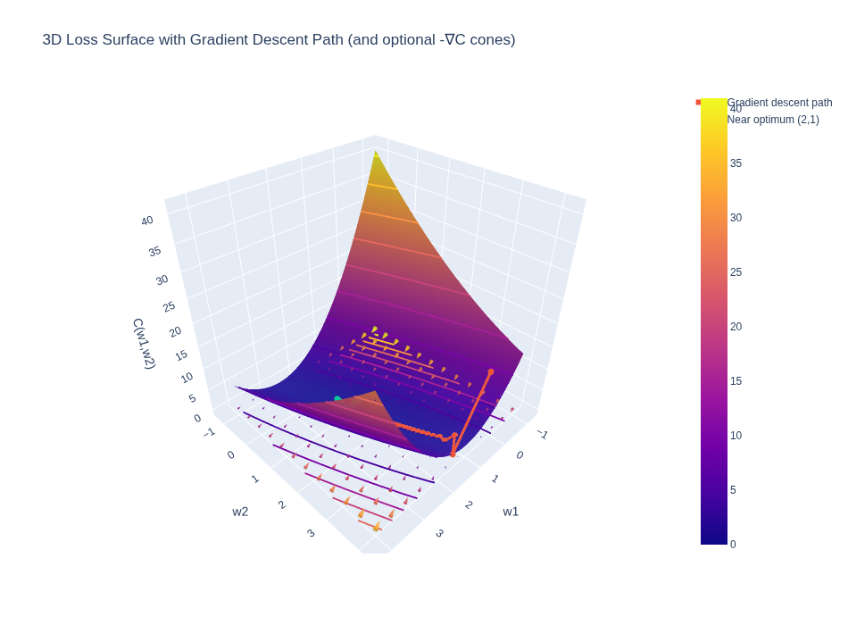
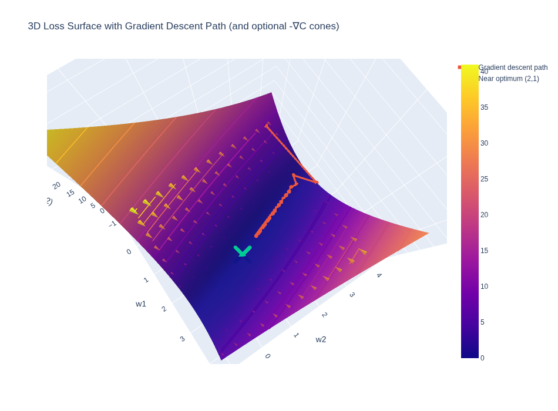

# The Mathematical Intuition Behind Deep Learning

Alex Punnen \
&copy; All Rights Reserved

---

[Contents](index.md)


# Chapter 6

## Back Propagation -Matrix Calculus

The previous chapters we used a Scalar derivation of the Back Propagation formula to implement it in a simple two layer neural network. What we have done is is to use Hadamard product and matrix transposes with scalar derivation alignment.

But we have not really explained why we use Hadamard product and matrix transposes with scalar derivation alignment.

This is due to Matrix Calculus which is the real way in which we should be deriving the Back Propagation formula.

Lets explore this in this chapter. Note that we are still not using a Softmax activation function in the output layer as is usually the case with Deep Neural Networks. Deriving the Back Propagation formula with Softmax activation function is bit more complex and we will do that in a later chapter.

Let's take the previous two layered simple neural network,with a Mean Square Error Loss function, and derive the Back Propagation formula with Matrix Calculus now.

Let's write the  equation of the following neural network

```python
x is the Input
y is the Output.
l is the number of layers of the Neural Network.
a is the activation function ,(we use sigmoid here)
```

$$
 x \rightarrow a^{l-1} \rightarrow  a^{l} \rightarrow  y
$$

Where the activation $a^l$ is
$$
  a^{l} = \sigma(W^l a^{l-1}+b^l).
$$

and

$$
a^{l} = \sigma(z^l) \quad where \quad
z^l =W^l a^{l-1} +b^l
$$

Our two layer neural network can be written as

 $$
 \mathbf { a^0 \rightarrow a^{1} \rightarrow  a^{2} \rightarrow  y }
 $$

($a^2$ does not denote the exponent but just that it is of layer 2)


## Some Math Intuition

The concept of a Neural Network as a composition of functions remains central.

In our network, most layers represent functions that map a **Vector to a Vector** ($\mathbb{R}^n \to \mathbb{R}^m$). For example, the hidden layers take an input vector and produce an activation vector.

However, the final step—calculating the Loss—is different. It maps the final output vector $a^L$ (and the target $y$) to a single **Scalar** value, the Cost $C$ ($\mathbb{R}^n \to \mathbb{R}$).

### Gradient Vector

When we take the derivative of a scalar-valued function (like the Cost $C$) with respect to a vector (like the weights $w$), the result is a vector of the same size as $w$. This is called the **Gradient Vector**.

$$
\nabla_w C = \begin{bmatrix} \frac{\partial C}{\partial w_1} \\ \vdots \\ \frac{\partial C}{\partial w_n} \end{bmatrix}
$$

Why is it called a “gradient”?

Because the gradient points in the direction of steepest increase of the function.

Moving a tiny step along $+\nabla_w C$ increases the cost the fastest.

Moving a tiny step against it, i.e. along $-\nabla_w C$, decreases the cost the fastest.

That’s exactly why gradient descent updates parameters like this:

$$
w \leftarrow w - \eta \nabla_w C
$$

where $\eta$ is the learning rate.

So the gradient vector is more than a list of derivatives—it’s the local direction that tells us how to change parameters to reduce the loss.

See the Colab [1] for a generated visualization of this.

The first image is the plotting of the Cost function



The second image where you see the cones are the gradient vector of the Cost function wrto weights plotted in 3D space.




## Jacobian Matrix

The second key concept is the **Jacobian Matrix**.

As mentioned earlier, in our network, most layers represent functions that map a **Vector to a Vector** ($\mathbb{R}^n \to \mathbb{R}^m$). For example, a hidden layer takes an input vector $x$ and produces an activation vector $a$.

What is the derivative of a vector-valued function with respect to a vector input? This is where the Jacobian comes in.

For a function $f: \mathbb{R}^n \to \mathbb{R}^m$ that maps an input vector $x$ of size $n$ to an output vector $y$ of size $m$, the derivative is an $m \times n$ matrix called the Jacobian Matrix $J$.

The entry $J_{ij}$ is the partial derivative of the $i$-th output component with respect to the $j$-th input component:

$$
J_{ij} = \frac{\partial f_i}{\partial x_j}
$$

### The Chain Rule with Matrices

The beauty of the Jacobian is that it allows us to generalize the chain rule.

For scalar functions, the chain rule is just multiplication: $(f \circ g)'(x) = f'(g(x)) \cdot g'(x)$.

For vector functions, the chain rule becomes **Matrix Multiplication** of the Jacobians:

If we have a composition of functions $y = f(g(x))$, and we let $A$ be the Jacobian of $f$ and $B$ be the Jacobian of $g$, then the Jacobian of the composition is simply the matrix product $A \cdot B$.

$$
(A \cdot B)_{ij} = \sum_{k=1}^m A_{ik} \cdot B_{kj}
$$

So, the Jacobian is a matrix of partial derivatives that represents the local linear approximation of a vector function. When we say the Jacobian represents a "local linear approximation," we mean:

$$ \text{Change in Output} \approx \text{Jacobian Matrix} \cdot \text{Change in Input} $$

$$ \Delta y \approx J \cdot \Delta x $$

It tells us: "If I nudge the input vector by a tiny vector $\Delta x$, the output vector will change by roughly the matrix-vector product $J \cdot \Delta x$."

### BackPropogation Trick - VJP (Vector Jacobian Product) and JVP (Jacobian Vector Product) 

There is one more trick that we can use to make backpropogation more efficient. 

Let me explain with an example.

Suppose we have a chain of functions: $y = f(g(h(x)))$.
To find the derivative $\frac{\partial y}{\partial x}$, the chain rule tells us to multiply the Jacobians:
$$ J_{total} = J_f \cdot J_g \cdot J_h $$

If $x, h, g, f$ are all vectors of size 1000, then each Jacobian is a $1000 \times 1000$ matrix. Multiplying them is expensive ($O(N^3)$).

**However, in Backpropagation, we always start with a scalar Loss function.**
The final derivative $\frac{\partial C}{\partial y}$ is a row vector (size $1 \times N$).

So we are computing:
$$ \nabla C = \underbrace{\frac{\partial C}{\partial y}}_{1 \times N} \cdot \underbrace{J_f}_{N \times N} \cdot \underbrace{J_g}_{N \times N} \cdot \underbrace{J_h}_{N \times N} $$

Notice the order of operations matters!
1.  **Jacobian-Matrix Product**: If we multiply the matrices first ($J_f \cdot J_g$), we do expensive matrix-matrix multiplication.
2.  **Vector-Jacobian Product (VJP)**: If we multiply from left to right:
    *   $v_1 = \frac{\partial C}{\partial y} \cdot J_f$ (Vector $\times$ Matrix $\to$ Vector)
    *   $v_2 = v_1 \cdot J_g$ (Vector $\times$ Matrix $\to$ Vector)
    *   $v_3 = v_2 \cdot J_h$ (Vector $\times$ Matrix $\to$ Vector)

We **never** explicitly compute or store the full Jacobian matrix. We only compute the product of a vector with the Jacobian. This is much faster ($O(N^2)$) and uses less memory.

This is the secret sauce of efficient Backpropagation! 


### Hadamard Product

Another important operation we use is the **Hadamard Product** (denoted by $\odot$ or sometimes $\circ$). This is simply **element-wise multiplication** of two vectors or matrices of the same size.

$$
\begin{bmatrix} a_1 \\ a_2 \end{bmatrix} \odot \begin{bmatrix} b_1 \\ b_2 \end{bmatrix} = \begin{bmatrix} a_1 \cdot b_1 \\ a_2 \cdot b_2 \end{bmatrix}
$$

It is different from the dot product (which sums the results to a scalar) and matrix multiplication. In backpropagation, it often appears when we apply the chain rule through an activation function that operates element-wise (like sigmoid or ReLU).

---
## Backpropagation Derivation

### The 2-Layer Neural Network Model

For this derivation, we use a simple 2-layer network (one hidden layer, one output layer):

$$
x \xrightarrow{W^1, b^1} a^1 \xrightarrow{W^2, b^2} a^2
$$

**Forward Pass Equations:**
1.  **Hidden Layer:**
    $$ z^1 = W^1 x + b^1 $$
    $$ a^1 = \sigma(z^1) $$
2.  **Output Layer:**
    $$ z^2 = W^2 a^1 + b^2 $$
    $$ a^2 = \sigma(z^2) $$

We use the **Mean Squared Error (MSE)** loss function:
$$ C = \frac{1}{2} \|y - a^2\|^2 $$

### Gradient Vector/2D-Tensor of Loss function in last layer

$$
C = \frac{1}{2} \|y - a^2\|^2 = \frac{1}{2} \sum_j (y_j-a^2_j)^2
$$

Where:
$$
a^2 = \sigma(z^2) \quad \text{and} \quad z^2 = W^2 a^1 + b^2
$$

We want to find $\frac{\partial C}{\partial W^2}$. Using the Chain Rule:

$$
\frac{\partial C}{\partial W^2} = \frac{\partial C}{\partial z^2} \cdot \frac{\partial z^2}{\partial W^2}
$$

Let's define the **error term** $\delta^2$ as the derivative of the cost with respect to the pre-activation $z^2$:

$$
\delta^2 \equiv \frac{\partial C}{\partial z^2} = \frac{\partial C}{\partial a^2} \odot \frac{\partial a^2}{\partial z^2}
$$

1.  $\frac{\partial C}{\partial a^2} = (a^2 - y)$
2.  $\frac{\partial a^2}{\partial z^2} = \sigma'(z^2)$

So, using the Hadamard product ($\odot$) for element-wise multiplication:

---

Note that none of these terms are exponents but super scripts.!

**Hadamard product or Element-wise multiplication**

The confusion usually lies in this term:$$\frac{\partial a}{\partial z}$$

Since $a$ is a vector and $z$ is a vector, the derivative of one with respect to the other is technically a Jacobian Matrix, not a vector.However, because the activation function $\sigma$ is applied element-wise (i.e., $a_i$ depends only on $z_i$, not on $z_j$ - That is - activation function in one layer is just dependent of the output of only the previous layer and no other layers), all off-diagonal elements of this Jacobian are zero.

$$
J = \frac{\partial a}{\partial z} = \begin{bmatrix}
\sigma'(z_1) & 0 & \dots \\
0 & \sigma'(z_2) & \dots \\
\vdots & \vdots & \ddots
\end{bmatrix}$$

When you apply the chain rule, you are multiplying the gradient vector $\nabla_a C$ by this diagonal matrix $J$ - VJP (Vector-Jacobian Product).

Key Identity: Multiplying a vector by a diagonal matrix is mathematically identical to taking the Hadamard product of the vector and the diagonal elements and this is why we use Hadamard product in backpropogation.

$$
\delta^2 = (a^2 - y) \odot \sigma'(z^2)
$$

---

Now for the second part, we need to find how the Cost changes with respect to the weights $W^2$.

We know that $z^2 = W^2 a^1$. In index notation, for a single element $z^2_i$:
$$ z^2_i = \sum_k W^2_{ik} a^1_k $$

We want to find $\frac{\partial C}{\partial W^2_{ik}}$. Using the chain rule:
$$ \frac{\partial C}{\partial W^2_{ik}} = \frac{\partial C}{\partial z^2_i} \cdot \frac{\partial z^2_i}{\partial W^2_{ik}} $$

1.  We already defined $\frac{\partial C}{\partial z^2_i} = \delta^2_i$.
2.  From the linear equation $z^2_i = \dots + W^2_{ik} a^1_k + \dots$, the derivative with respect to $W^2_{ik}$ is simply $a^1_k$.

So:
$$ \frac{\partial C}{\partial W^2_{ik}} = \delta^2_i \cdot a^1_k $$

If we organize these gradients into a matrix, the element at row $i$ and column $k$ is the product of the $i$-th element of $\delta^2$ and the $k$-th element of $a^1$.


Let's visualize the matrix of gradients $\nabla W$:$$\nabla W =
\begin{bmatrix}
\frac{\partial C}{\partial W_{11}} & \frac{\partial C}{\partial W_{12}} \\
\frac{\partial C}{\partial W_{21}} & \frac{\partial C}{\partial W_{22}}
\end{bmatrix}$$Substitute the result from step 3 ($\delta_i \cdot a_k$):$$\nabla W =
\begin{bmatrix}
\delta_1 a_1 & \delta_1 a_2 \\
\delta_2 a_1 & \delta_2 a_2
\end{bmatrix}$$


 This is exactly the definition of the **Outer Product**  $\otimes$ of two vectors:

$$
\frac{\partial C}{\partial W^2} =  \delta^2 \otimes a^1 = \delta^2  (a^1)^T \quad \rightarrow (Eq \; 3)
$$

This gives us the gradient matrix for the last layer weights.

&nbsp;

## Jacobian of Loss function in Inner Layer

Now let's do the same for the inner layer ($W^1$).

$$
\frac{\partial C}{\partial W^1} = \frac{\partial C}{\partial z^1} \cdot \frac{\partial z^1}{\partial W^1} = \delta^1 (a^0)^T
$$

We need to find $\delta^1 = \frac{\partial C}{\partial z^1}$. We can backpropagate the error $\delta^2$ from the next layer:

$$
\delta^1 = \frac{\partial C}{\partial z^1} = \left( (W^2)^T \delta^2 \right) \odot \sigma'(z^1)
$$

**Explanation:**
1.  We propagate $\delta^2$ backwards through the weights $(W^2)^T$.
2.  We multiply element-wise by the derivative of the activation function $\sigma'(z^1)$.

Putting it all together:

$$
\frac{\partial C}{\partial W^1} = \left( (W^2)^T \delta^2 \odot \sigma'(z^1) \right) (a^0)^T \quad \rightarrow (Eq \; 5)
$$

### Summary of Backpropagation Equations

1.  **Compute Output Error:**
    $$ \delta^L = (a^L - y) \odot \sigma'(z^L) $$
2.  **Backpropagate Error:**
    $$ \delta^l = ((W^{l+1})^T \delta^{l+1}) \odot \sigma'(z^l) $$
3.  **Compute Gradients:**
    $$ \frac{\partial C}{\partial W^l} = \delta^l (a^{l-1})^T $$

&nbsp;

### Summary of Backpropagation Equations in terms of say Numpy

Here is how these equations translate to Python code using NumPy, assuming standard column vectors (shape `(N, 1)`).

```python
# Forward pass context:
# x, a1, a2 are column vectors
# W1, W2 are weight matrices
# sigmoid_prime(z) is the derivative of activation

# 1. Compute Output Error (Hadamard Product)
# '*' operator in numpy is element-wise multiplication (Hadamard)
delta2 = (a2 - y) * sigmoid_prime(z2) 

# 2. Gradient for W2 (Outer Product)
# We need shape (n_out, 1) @ (1, n_hidden) -> (n_out, n_hidden)
dC_dW2 = np.matmul(delta2, a1.T)

# Alternative using einsum for outer product:
# dC_dW2 = np.einsum('i,j->ij', delta2.flatten(), a1.flatten())

# 3. Backpropagate Error to Hidden Layer
# Matrix multiplication (W2.T @ delta2) followed by Hadamard product
delta1 = np.matmul(W2.T, delta2) * sigmoid_prime(z1)

# 4. Gradient for W1 (Outer Product)
dC_dW1 = np.matmul(delta1, x.T)
```


## Using Gradient Descent to find the optimal weights to reduce the Loss function

&nbsp;

With equations (3) and (5) we can calculate the gradient of the Loss function with respect to weights in any layer - in this example 

$$\frac {\partial C}{\partial W^1},\frac {\partial C}{\partial W^2}$$

&nbsp;

We now need to adjust the previous weight, by gradient descent.

&nbsp;

So using the above gradients we get the new weights iteratively like below. If you notice this is exactly what is happening in gradient descent as well; only chain rule is used to calculate the gradients here. Backpropagation is the algorithm that helps calculate the gradients for each layer.

&nbsp;

$$\mathbf {
  W^{l-1}_{new} = W^{l-1}_{old} - \eta \cdot \frac{\partial C}{\partial W^{l-1}}
}$$


&nbsp;

Where $\eta$ is the learning rate.

Reference  

- <https://cedar.buffalo.edu/~srihari/CSE574/Chap5/Chap5.3-BackProp.pdf>
- <http://neuralnetworksanddeeplearning.com/chap2.html>

 [1]: https://colab.research.google.com/drive/1sMODrDCdR7lKF9cWcNNhhdLglxJRzmgK?usp=sharing

Next: [Back Propagation in Full - With Softmax & CrossEntropy Loss](8_backpropogation_full.md)