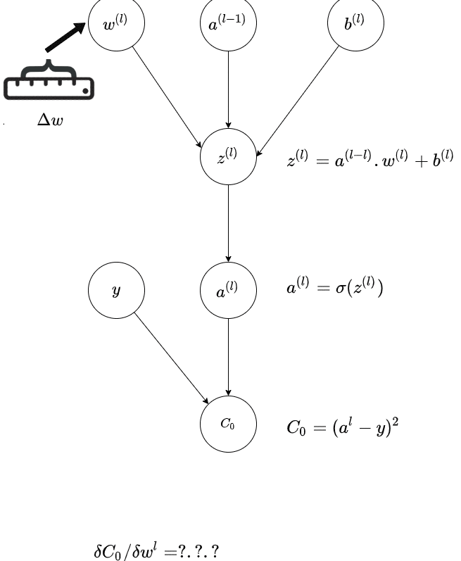
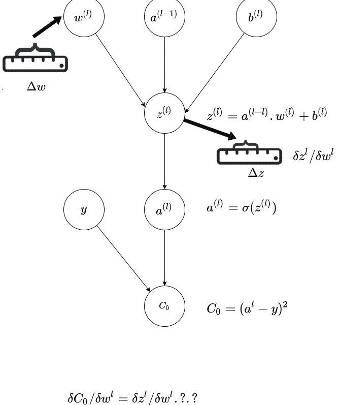
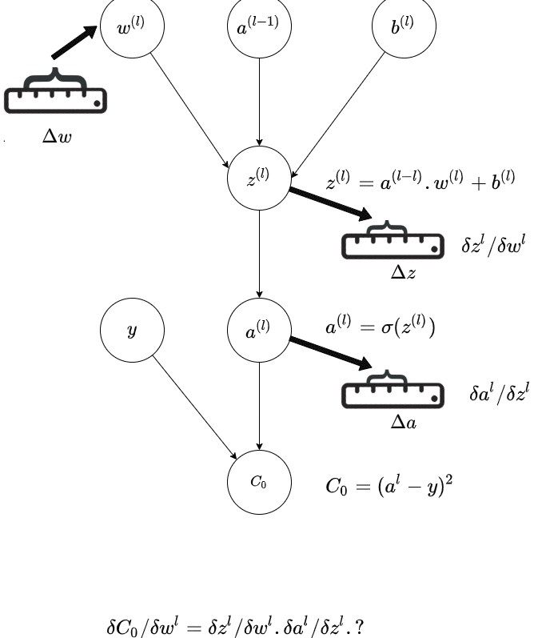
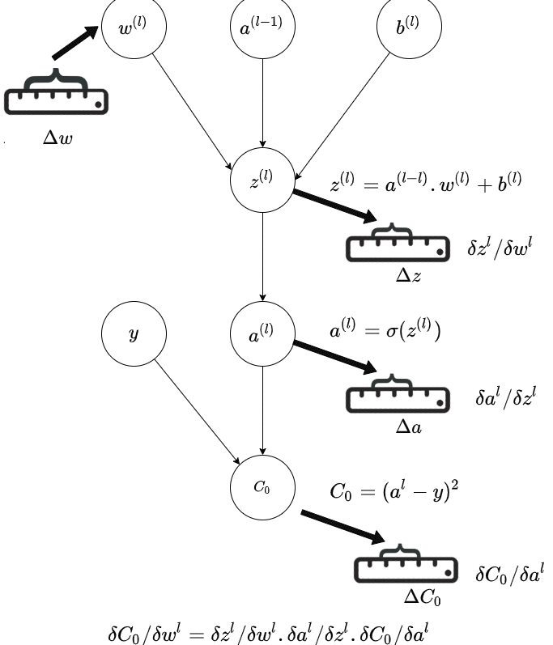

# Backpropagation with Scalar Calculus

In this chapter lets deep dive a bit more into the technique of Back Propagation

## How Backpropagation Works

Consider a neural network with multiple layers. The weight of layer $l$ is $W^l$.  And for the previous layer it is $W^{l-1}$.

The best way to understand backpropagation is visually and by the way it is done by the tree representation of 3Blue1Brown video linked [here](https://www.youtube.com/watch?v=tIeHLnjs5U8).

 The below  GIF is a representation of a single path in the last layer($l$ of a neural network; and it shows how the connection from previous layer - that is the activation of the previous layer and the weight of the current layer is affecting the output; and thereby the final Cost.

The central idea is how a **small change** in weight in the previous layer affects the final output of the network.

::: {layout-ncol=2}

:::

Source : Author

## Writing This Out as Chain Rule

Here is a more detailed depiction of how the small change in weight adds through the chain to affect the final cost, and **how much** the small change of weight in an inner layer affect the final cost.

This is the **Chain Rule** of Calculus and the diagram is trying to illustrate that visually via a chain of activations, via a **Computational Graph**

$$
\frac{\partial C}{\partial W^l} = \frac{\partial C}{\partial a^l} \cdot \frac{\partial a^l}{\partial z^l} \cdot \frac{\partial z^l}{\partial W^l}
$$

Next part of the recipe is adjusting the weights of each layers, depending on how they contribute to the Cost. We have already seen this in the previous chapter.

The weights in each layer are adjusted in proportion to how each layers weights affected the Cost function.

This is by calculating the new weight by following the negative of the gradient of the Cost function - basically by gradient descent.

$$
  W^l_{new} = W^l_{old} - \eta \cdot \frac{\partial C}{\partial W^l}
$$

For adjusting the weight in the  $(l-1)$ layer, we do similar

First calculate how the weight in this layer contributes to the final Cost or Loss

$$
\frac{\partial C}{\partial W^{l-1}} = \frac{\partial C}{\partial a^{l-1}} \cdot \frac{\partial a^{l-1}}{\partial z^{l-1}} \cdot \frac{\partial z^{l-1}}{\partial W^{l-1}}
$$

and using this. Basically we are using Chain rule to find the partial differential using the partial differentials calculated in earlier steps.

$$
  W^{l-1}_{new} = W^{l-1}_{old} - \eta \cdot \frac{\partial C}{\partial W^{l-1}}
$$

## Neural Net as a Composition of Vector Functions

Lets first look at a neural network as a  composition of vector functions.

Imagine a simple neural network with 3 layers. It is essentially a composition of three functions:

A neural network is a composition of vector-valued functions, followed by a scalar-valued cost function:

$$
\begin{aligned}
C &= \text{Cost}(a^3) \\
a^3 &= f^3(f^2(f^1(x)))
\end{aligned}
$$

Where $f^1$, $f^2$ and $f^3$ are the functions computed by the three layers of the network and  

Each layer is defined as:

$$
z^i = W^i a^{i-1} + b^i, \quad a^i = \sigma(z^i)
$$

And gradient descent is defined as:

$$(W^i)_{new} = (W^i)_{old} - \eta \cdot \partial C / \partial W^i$$

Problem is to find the partial derivative of the loss function with respect to the weights at each layer.

To calculate how a change in the first layer's weights ($W^1$) affects the final Cost ($C$), we have to trace the "path of influence" all the way through the network.

A nudge in $W^1$ changes the output of Layer 1. The change in Layer 1 changes the input to Layer 2. The change in Layer 2 changes the input to Layer 3. The change in Layer 3 changes the final Cost.

Mathematically, we multiply the derivatives (Linear Maps) of these links together:

We need to update weights of three layers

$$(W^1)_{new} = (W^1)_{old} - \eta \cdot \partial C / \partial W^1$$

$$(W^2)_{new} = (W^2)_{old} - \eta \cdot \partial C / \partial W^2$$

$$(W^3)_{new} = (W^3)_{old} - \eta \cdot \partial C / \partial W^3$$

And for that we need to find $ \partial C / \partial W^1 $, $ \partial C / \partial W^2 $, $ \partial C / \partial W^3 $.

Lets write down the chain rule for each layer:

$$\frac{\partial C}{\partial W^1} = \frac{\partial C}{\partial a^3} \cdot \frac{\partial a^3}{\partial a^2} \cdot \frac{\partial a^2}{\partial a^1} \cdot \frac{\partial a^1}{\partial W^1}$$

$$\frac{\partial C}{\partial W^2} = \frac{\partial C}{\partial a^3} \cdot \frac{\partial a^3}{\partial a^2} \cdot \frac{\partial a^2}{\partial W^2}$$

$$\frac{\partial C}{\partial W^3} = \frac{\partial C}{\partial a^3} \cdot \frac{\partial a^3}{\partial W^3}$$

Why is this written this way? By the **chain rule**, **the derivative of a composition of functions is the product of the derivatives of the functions**. It is thus easy to calculate the gradient of the loss with respect to the weights of each layer.

Lets calculate the gradient of the loss with respect to the weights of the first layer.

Notice something interesting?

*   To calculate $\frac{\partial C}{\partial W^3}$, we need $\frac{\partial C}{\partial a^3}$.

*   To calculate $\frac{\partial C}{\partial W^2}$, we need $\frac{\partial C}{\partial a^3} \cdot \frac{\partial a^3}{\partial a^2}$.

*   To calculate $\frac{\partial C}{\partial W^1}$, we need $\frac{\partial C}{\partial a^3} \cdot \frac{\partial a^3}{\partial a^2} \cdot \frac{\partial a^2}{\partial a^1}$.

We are re-calculating the same terms over and over again!

If we start from the **Output** (Layer 3) and move **Backwards**:
1.  We calculate $\frac{\partial C}{\partial a^3}$ once. We use it to find the update for $W^3$.

2.  We pass this value back to find $\frac{\partial C}{\partial a^2}$ (which is $\frac{\partial C}{\partial a^3} \cdot \frac{\partial a^3}{\partial a^2}$). We use it to find the update for $W^2$.

3.  We pass *that* value back to find $\frac{\partial C}{\partial a^1}$. We use it to find the update for $W^1$.

This avoids redundant calculations and is why it's called **Backpropagation**.

It is essentially **Dynamic Programming** applied to the Chain Rule.

### The Backpropagation Algorithm Step-by-Step

**Step 1: The Output Layer (layer 3)**

We want to find the gradient $\frac{\partial C}{\partial W^3}$.
Using the Chain Rule:
$$ \frac{\partial C}{\partial W^3} = \frac{\partial C}{\partial a^3} \cdot \frac{\partial a^3}{\partial z^3} \cdot \frac{\partial z^3}{\partial W^3} $$

Let's break it down term by term:

1.  **Derivative of Cost w.r.t Activation** ($\frac{\partial C}{\partial a^3}$):
    For MSE $C = \frac{1}{2}(a^3 - y)^2$:
    $$ \frac{\partial C}{\partial a^3} = (a^3 - y) $$

2.  **Derivative of Activation w.r.t Input** ($\frac{\partial a^3}{\partial z^3}$):
    Since $a^3 = \sigma(z^3)$:
    $$ \frac{\partial a^3}{\partial z^3} = \sigma'(z^3) $$

3.  **Derivative of Input w.r.t Weights** ($\frac{\partial z^3}{\partial W^3}$):
    Since $z^3 = W^3 a^2 + b^3$:
    $$ \frac{\partial z^3}{\partial W^3} = a^2 $$

**Combining them:**
We define the "error" term $\delta^3$ at the output layer as:
$$ \delta^3 = \frac{\partial C}{\partial z^3} = (a^3 - y) \odot \sigma'(z^3) $$

> **Note on $\odot$ (Hadamard Product)**: We use element-wise multiplication here because both $(a^3 - y)$ and $\sigma'(z^3)$ are vectors of the same size.
>
> The Jacobian of an element-wise activation $\sigma$ is a diagonal matrix:
> $$ \frac{\partial a}{\partial z} = \text{diag}(\sigma'(z)) $$
>
> So multiplying by it is the same as a Hadamard product:
> $$ \text{diag}(\sigma'(z)) \, v = v \odot \sigma'(z) $$

We will see the Jacobian and Gradient Vector later.

So the gradient for the weights is:
$$ \frac{\partial C}{\partial W^3} = \delta^3 \cdot (a^2)^T $$

> **Note on Transpose ($(a^2)^T$)**: In backprop, we push gradients through a linear map $z = Wa + b$. The Jacobian w.r.t. $a$ is $W$, so the chain rule gives:
>
> $$ \frac{\partial C}{\partial a} = W^T \frac{\partial C}{\partial z} $$
>
> The transpose appears because we’re applying the transpose (adjoint) of the Jacobian to move gradients backward.

**Result**: We have the update for $W^3$.

$$(W^3)_{new} = (W^3)_{old} - \eta \cdot \partial C / \partial W^3$$

**Step 2: Propagate Back to layer 2**

Now we need to find the gradient for the second layer weights: $\frac{\partial C}{\partial W^2}$.
Using the Chain Rule, we can reuse the error from the layer above:
$$ \frac{\partial C}{\partial W^2} = \frac{\partial C}{\partial z^2} \cdot \frac{\partial z^2}{\partial W^2} = \delta^2 \cdot (a^1)^T $$

But what is $\delta^2$ (the error at layer 2)?
$$ \delta^2 = \frac{\partial C}{\partial z^2} = \frac{\partial C}{\partial z^3} \cdot \frac{\partial z^3}{\partial z^2} $$

We know $\frac{\partial C}{\partial z^3} = \delta^3$.
And since $z^3 = W^3 \sigma(z^2) + b^3$:
$$ \frac{\partial z^3}{\partial z^2} = W^3 \, \text{diag}\!\left(\sigma'(z^2)\right) $$

So, we can calculate $\delta^2$ by "backpropagating" $\delta^3$:
$$ \delta^2 = ((W^3)^T \cdot \delta^3) \odot \sigma'(z^2) $$

**The Update Rule for Layer 2:**
$$ \frac{\partial C}{\partial W^2} = \delta^2 \cdot (a^1)^T $$

**Result**: We have the update for $W^2$.
$$(W^2)_{new} = (W^2)_{old} - \eta \cdot \frac{\partial C}{\partial W^2}$$

**Step 3: Propagate Back to layer 1**

We repeat the exact same process to find the error at the first layer $\delta^1$.
$$ \delta^1 = ((W^2)^T \cdot \delta^2) \odot \sigma'(z^1) $$

**The Update Rule for Layer 1:**
$$ \frac{\partial C}{\partial W^1} = \delta^1 \cdot x^T $$
(Recall that $a^0 = x$, the input).

**Result**: We have the update for $W^1$.
$$(W^1)_{new} = (W^1)_{old} - \eta \cdot \frac{\partial C}{\partial W^1}$$

### Summary

So, Backpropagation is the efficient execution of the Chain Rule by utilizing the linear maps of each layer in reverse order.
*   It computes the local linear map (Jacobian) of a layer.
*   It takes the incoming gradient vector from the future layer.
*   It performs a Vector-Jacobian Product to pass the gradient to the past layer.

Next [Backpropagation with Matrix Calculus](5_backpropogation_matrix_calculus.md)

---

## References

- [Neural Networks and Deep Learning - Michael Nielsen](http://neuralnetworksanddeeplearning.com/chap2.html)
- [A Step by Step Backpropagation Example - Matt Mazur](https://mattmazur.com/2015/03/17/a-step-by-step-backpropagation-example/)

[neuralnetwork]: images/neuralnet2.png
[backpropogation]: images/backprop1.png
[backpropogationgif]: images/backprop_1.png
[backpropogationgif2]: images/backprop_2.png
