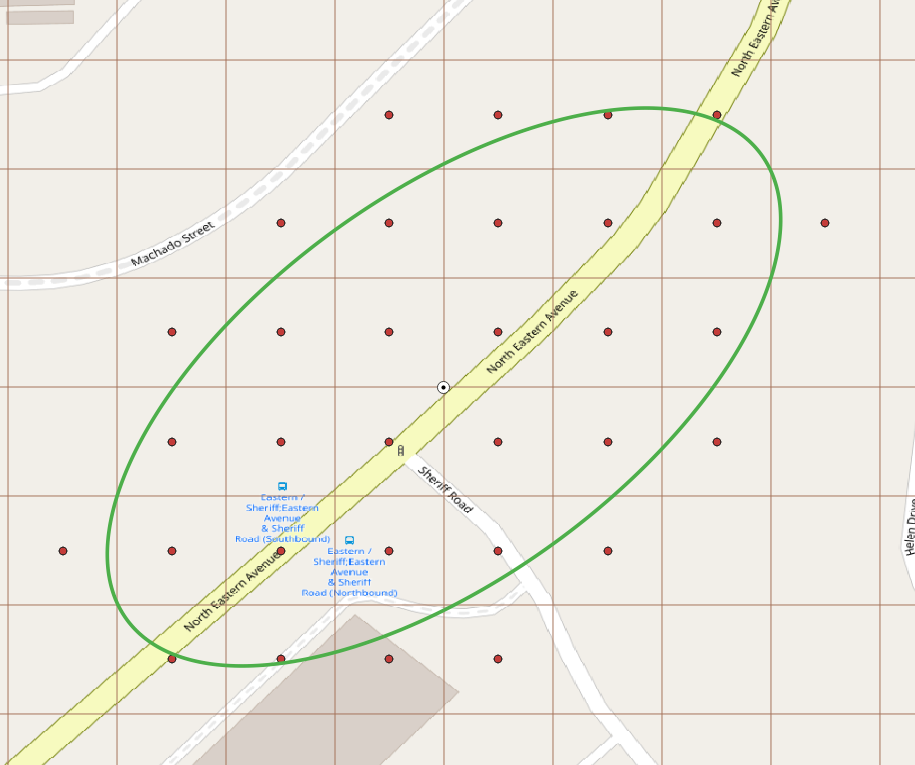
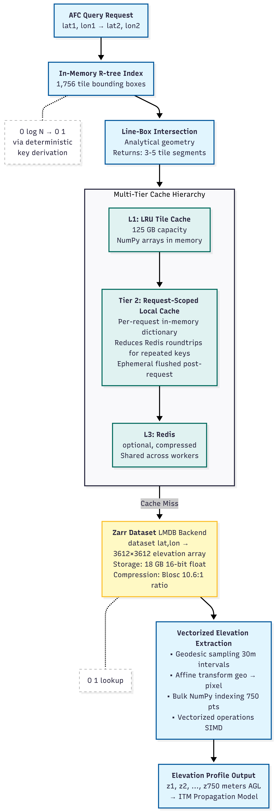
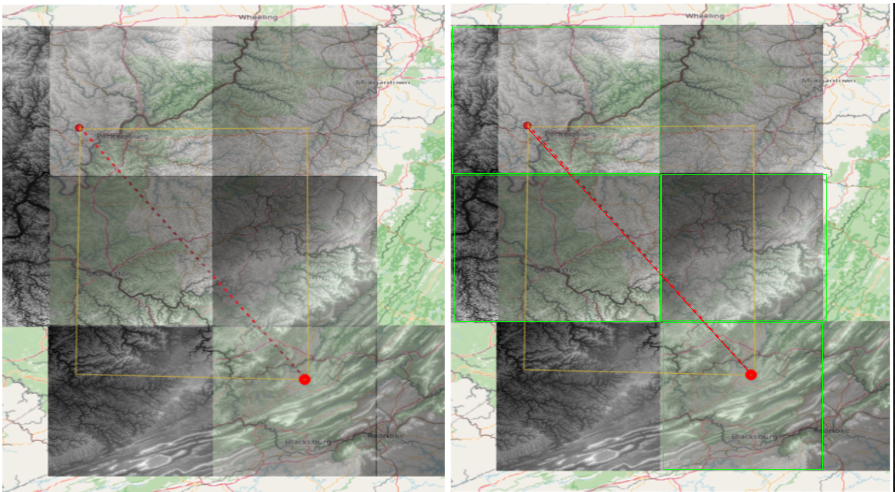

## Abstract

Large-scale radio propagation modeling for Automated Frequency Coordination (AFC) systems requires frequent access to high-resolution terrain elevation data across continental-scale geographic regions. Traditional file-based raster storage introduces substantial overhead due to repeated tile discovery, file I/O, and decompression during terrain profile extraction.

This paper presents a high-performance data management architecture for efficient retrieval of terrain elevation data derived from the U.S. 3D Elevation Program (3DEP) and National Elevation Dataset (NED). The architecture consists of three key components:
    (1) a Zarr-based chunked storage layer with LMDB-backed memory-mapped indexing that enables direct coordinate-based retrieval of elevation samples without conventional raster tile parsing;
    (2) an in-memory R-tree that rapidly identifies terrain tiles intersecting the propagation path between an access point and a receiver; and
    (3) a vectorized terrain profile extraction pipeline implemented with NumPy, supporting efficient parallel execution for large-scale AFC spectrum availability calculations.

Experimental evaluation on a continental-scale elevation corpus containing approximately 22.9 billion elevation samples across 1,756 tiles demonstrates substantial improvements in both storage efficiency and lookup throughput. The system achieves 10.6× compression (170 GB to 18 GB) while preserving sub-meter precision required for AFC calculations, and supports approximately 4.7–5.9 million elevation lookups per second on commodity hardware.

These results demonstrate that chunked array storage provides a practical and scalable foundation for high-throughput terrain data access in telecom propagation modeling systems.

---

## 1. Introduction

The allocation of the 6 GHz frequency band (5.925–7.125 GHz) for unlicensed use stands as a watershed moment in spectrum policy, releasing 1,200 megahertz of spectrum to fuel next-generation Wi-Fi 6E and Wi-Fi 7 technologies. However, this band is already occupied by critical incumbent Fixed Service (FS) microwave links. To reconcile ubiquitous unlicensed access with incumbent protection, regulators (FCC Report and Order 20-51) have mandated the Automated Frequency Coordination (AFC) system.

Unlike previous regimes, 6 GHz Standard Power devices must query a centralized AFC system before transmitting. This system must deterministically calculate spectrum availability based on precise 3D geolocation and high-fidelity propagation modeling (ITM, WINNER II). Consequently, the engineering challenge is not merely database lookups but complex computational geometry over irregular terrain.

The performance and economic viability of an AFC system hinge on its data architecture. The system must ingest, index, and query terabytes of geospatial raster data—specifically the USGS 3D Elevation Program (3DEP) and National Land Cover Database (NLCD)—with low latency. This paper analyzes the architectural trade-offs in managing this data substrate, scrutinizing traditional file-based approaches (GDAL/Rasterio with GeoTIFF/GridFloat tiles) against a modern, cloud-native chunked-array approach utilizing the Zarr specification.

---

## 2. Computational Scale of AFC Queries

A single AFC query in a dense urban area requires evaluating propagation paths to all incumbent receivers within range. The computational burden is substantial:

| Parameter | Typical Value | Description |
|-----------|---------------|-------------|
| Incumbents in range | ~3,137 | FS receivers within 200 km radius |
| Uncertainty points | ~1,521 | Grid points within uncertainty ellipse |
| Antennas per receiver | ~6 | Average antenna count per FS receiver |
| **Total evaluations** | **~6 million** | Per device query |


*Table: Example ULS query showing multiple antennas per Fixed Service receiver*

```sql
SELECT call_sign, frequency_assigned, transmitter_make,
       transmitter_model, antenna_number
FROM frequency
WHERE unique_system_identifier = 1030982
  AND frequency_assigned >= 5925.0
  AND frequency_assigned <= 6425.0
```

| Call Sign | Freq (MHz) | Make | Model | Ant # |
|-----------|------------|------|-------|-------|
| WNTW465 | 6197.24 | Harris | MegaStar 2000/6 | 5 |
| WNTW465 | 6226.89 | Harris | MegaStar 2000/6 | 6 |
| WNTW465 | 6256.54 | Harris | MegaStar 2000/6 | 5 |
| WNTW465 | 6286.19 | Harris Corp | BCK9GKMSTR0630-1 | 6 |
| WNTW465 | 6286.19 | Harris | MegaStar 2000/6 | 6 |

AFC regulations (R2-AIP-22) require evaluating all points within an uncertainty ellipse at ≤1 arc-second horizontal resolution and ≤5m vertical resolution.

{width=70%}

*Figure 1: Location uncertainty ellipse with evaluation grid points*

Per WINNF TS-1014, the maximum protection distance is 200 km. For each Standard Power device query:

**Base computation:** 3,137 incumbents × 1,521 uncertainty points = **~4.8 million path profile calculations**

With multiple antennas and frequency bands, total evaluations approach **6 million per query**. Each path profile requires up to 750 elevation lookups, making terrain retrieval the dominant I/O bottleneck.

## 3. System Architecture

{height=8in}

### 3.2 Core Technologies

| Technology | Purpose |
|------------|---------|
| **Zarr** | Chunked, compressed N-dimensional array storage with `LMDBStore` backend |
| **R-trees** | Spatial indexing for coarse filtering (deterministic grid enables near-constant (≈O(1)) access) |
| **NumPy** | SIMD-accelerated vectorized operations |
| **Rasterio/Affine** | Geospatial coordinate transformations |
| **PyProj/Geod** | WGS84 ellipsoid geodetic calculations |

### 3.3 Data Organization

The elevation dataset is organized into fixed 1°×1° geographic tiles:

- **Tile dimensions**: 3612×3612 samples (includes 6-pixel edge overlap)
- **Total tiles**: 1,756 covering U.S. territories
- **Total samples**: 22,909,731,264 elevation points
- **Storage format**: 32-bit float with Blosc compression

### 3.4 Zarr Dataset Configuration

```python
store = zarr.LMDBStore(directoryStore, readonly=True, lock=False)
cache = zarr.LRUStoreCache(store, max_size=2**33)  # 8GB cache
dataset = zarr.open(
    store=cache,
    shape=[10**3, 10**3, 1, rows, columns],  # 5D array
    dtype="<f4",  # 32-bit float instead of original 64-bit
    chunks=[1, 1, 1, rows, columns],  # One chunk per tile
    mode="r",
    synchronizer=zarr.ThreadSynchronizer(),
)
```

**Design Decisions:**
- **Chunk Alignment**: Each 1° tile = single chunk, eliminating boundary overhead
- **LMDB Backend**: Memory-mapped I/O enables zero-copy reads
- **LRU Cache**: 8GB cache layer reduces repeated disk access

### 3.5 Deterministic Tile Keying

Unlike traditional spatial databases requiring index traversal, our system uses mathematical key derivation:

```text
tile_key = (floor(latitude), floor(longitude))  # O(1)
elevation_data = dataset[tile_key]              # Direct array access
```

**Example**: Coordinate `(37.7749°N, 122.4194°W)` → tile key `(37, -123)` → `dataset[37][-123]` returns 3612×3612 array.

This provides deterministic, near-constant-time (≈O(1)) tile access (keyed by grid coordinates) that avoids spatial-index traversal (≈O(log N)) and SQL planning/executor overhead typical of database-centric workflows.

### 3.6 R-tree Spatial Index for Fast Tile Discovery

While deterministic keying provides O(1) access to a *known* tile, a propagation path between a transmitter and receiver may span multiple tiles. Rather than iterating over all 1,756 tiles to find which ones intersect the path, we construct a lightweight in-memory R-tree spatial index at startup.

The R-tree is populated with the bounding boxes of all 1°×1° grid cells covering U.S. territories (continental US, Alaska, Hawaii, Puerto Rico, American Samoa, Guam, Northern Mariana Islands, and the U.S. Virgin Islands). Each territory is defined by its latitude and longitude range—for example, continental US spans latitudes 24°–50°N and longitudes 125°–62°W. The ranges are enumerated into individual 1°×1° cells, and each cell's bounding box is inserted into the R-tree along with its grid key `(lat, lon)` and tile dimensions.

The R-tree organizes these bounding boxes into a balanced tree of minimum bounding rectangles (MBRs). At query time, given the bounding box of a propagation path, the R-tree traverses only the branches whose MBRs intersect the query region—returning the few tiles that actually overlap the path:

| Approach | Tile Discovery Cost | For 200 km path |
|----------|---------------------|-----------------|
| Brute-force scan | O(N) = 1,756 comparisons | ~1,756 checks |
| R-tree intersection | O(log N) ≈ 3-4 node visits | ~3-5 candidates |

Because the tiles form a regular grid with uniform bounding boxes, the R-tree achieves near-optimal packing. The resulting index occupies only a few hundred kilobytes in memory and answers intersection queries in microseconds—making tile discovery negligible compared to the subsequent elevation extraction.

---

## 4. Query Execution Pipeline

### Stage 1: Coarse Spatial Filtering

The R-tree constructed in Section 3.6 enables rapid identification of tiles intersecting the great-circle path:

```python
line_bbox = (min(lon1, lon2), min(lat1, lat2),
             max(lon1, lon2), max(lat1, lat2))
candidate_tiles = rtree_index.intersection(line_bbox, objects=True)
```

For a 200 km path, this typically narrows 1,756 tiles down to 3-5 candidates.

### Stage 2: Precise Line-Box Intersection


*Figure 2: Line segment intersection with tile boundaries*

For each candidate tile, analytical line-segment intersection determines exact entry/exit points using the parametric determinant method.

### Stage 3: Vectorized Elevation Extraction

**Geodesic Sampling** along WGS84 ellipsoid at 30-meter intervals (per FCC requirement):
```python
num_samples = min(ceil(distance_m / 30.0) + 1, 750)
intermediates = geod.npts(lon1, lat1, lon2, lat2, num_samples - 2)
```

**Affine Transformation** to pixel coordinates:
```python
transform = rasterio.transform.from_bounds(west, south, east, north, 3612, 3612)
inv_transform = ~transform
px, py = inv_transform * (lons, lats)  # Bulk transformation
```

**Bulk Elevation Lookup** via vectorized NumPy:
```python
row_idx = np.clip(np.floor(px).astype(int), 0, 3611)
col_idx = np.clip(np.floor(py).astype(int), 0, 3611)
elevations = elevation_tile[0, row_idx, col_idx]
```

### Geodetic Accuracy

All calculations use the WGS84 ellipsoid model via PyProj:

```python
geod = Geod(ellps="WGS84")
az12, az21, distance_m = geod.inv(lon1, lat1, lon2, lat2)
```

**Why not Haversine?**
| Model | Assumption | Error on long paths |
|-------|------------|---------------------|
| Haversine | Spherical Earth (6371 km) | Up to 500m |
| WGS84 | Ellipsoid (6378/6356 km) | <10m |

---

## 5. Comparative Analysis: Zarr vs. File-Based Access

The standard approach in spectrum systems—exemplified by the WInnForum SAS and OpenAFC reference implementations—uses file-based raster access: GeoTIFF or GridFloat tiles accessed via GDAL/Rasterio with application-level LRU caching. Our analysis indicates that a specialized Zarr-based architecture offers superior performance characteristics for massive, static raster datasets.

### 5.1 Summary Comparison

| Aspect | File-Based (GDAL/Rasterio) | Zarr + LMDB |
|--------|---------------------------|-------------|
| **Tile access** | File open → metadata parse → read window | Deterministic key → mmap page access |
| **Caching** | Application-level LRU (8-16 tiles typical) | OS page cache + LRU store cache (8GB+) |
| **Decompression** | Per-file, repeated on each open | Chunk-level, cached in decompressed form |
| **Concurrency** | File handle contention, GIL pressure | Lock-free mmap reads |
| **Cross-tile queries** | Manual tile stitching | Unified array addressing |

### 5.2 Retrieval Complexity

**File-Based (GDAL/Rasterio):** Each tile access requires opening the file, parsing headers (GeoTIFF tags, affine transform, CRS), seeking to the data window, decompressing, and closing. Even with caching, cache misses incur the full overhead.

```
Query → Tile lookup → File open → Parse header → Decompress → Read window → Close
```

**Zarr (Direct Lookup):** By enforcing a strict grid-based partitioning scheme, we mathematically derive the storage key from query coordinates. The underlying LMDB B+tree lookup is technically logarithmic in the number of keys, but with a fixed tile count and hot caches, access is near-constant (≈O(1)) in practice.

```
Query → tile_key = (floor(lat), floor(lon)) → KV Lookup → mmap Page Access
```

### 5.3 Storage and I/O Overhead

**File-Based Overhead:**
- File open/close syscalls per tile access
- Header parsing (TIFF IFDs, coordinate transforms)
- Decompression repeated on cache misses
- Small cache sizes due to memory management complexity
- No unified view across tiles

**Zero-Copy Access:**
The `zarr.LMDBStore` backend uses memory mapping (`mmap`), allowing the OS to map file content directly into the application's address space. Data transfers from disk to CPU cache without intermediate copying—critical for read-heavy workloads.

### 5.4 Concurrency and Scalability

**File-Based Approach:**
- File handle limits (ulimit) constrain parallelism
- GDAL's internal locking can create contention
- Each worker maintains separate cache (memory duplication)
- Cache coherency issues in multi-process deployments

**Zarr Approach:**
- Lock-free concurrent reads via memory-mapped I/O
- Zero serialization overhead (direct NumPy array access)
- No query planning (deterministic access pattern)
- LMDB readers scale linearly with CPU cores
- Shared page cache across all processes

The Zarr-based approach implements a "Write-Once-Read-Many" (WORM) pattern. Since elevation data is static, we avoid locking mechanisms required for transactional updates, enabling massive parallelism where multiple workers read disjoint chunks simultaneously without contention.

### 5.5 Applicability

| Use Case | Recommendation |
|----------|----------------|
| Static raster data (elevation, land cover) | **Zarr** |
| Read-heavy, high-concurrency (1000+ req/sec) | **Zarr** |
| Deterministic grid partitioning | **Zarr** |
| Serverless/stateless compute | **Zarr** |
| Small-scale or single-threaded access | **File-based** |
| Existing GDAL/Rasterio pipelines | **File-based** |
| Dynamic/frequently updated rasters | **File-based** |
| Integration with GIS desktop tools | **File-based** |

**Note on PostGIS:** While sometimes considered for geospatial workloads, PostGIS introduces even more overhead than file-based access for raster queries: SQL parsing, query planning, GiST index traversal (~O(log N)), WKB serialization, and MVCC transaction isolation. These features benefit transactional vector workloads but add unnecessary latency for read-only raster data at scale.

---

## 6. Caching Architecture

### Three-Tier Caching Hierarchy

**Tier 1: In-Memory Tile Cache (LRU)**
```python
my_cache = LRU(2500)  # ~50 MB per tile, ~125 GB total capacity
```
- Caches decompressed NumPy arrays
- Hit rate >95% for typical AFC workloads

**Tier 2: Request-Scoped Local Cache**
```python
local_cache = {}  # Per-request dictionary

if r_loss_key in local_cache:
    redis_loss = local_cache[r_loss_key]
else:
    redis_loss = redis_client.get(r_loss_key)
    if redis_loss:
        local_cache[r_loss_key] = redis_loss
```
- Reduces Redis roundtrips within a single AFC request
- Flushed after each request completes

**Tier 3: Redis Distributed Cache**
- Compressed profiles (zlib + msgpack)
- 12-hour TTL, 250 KB size limit per entry
- Enables cache sharing across workers

---

## 7. Experimental Evaluation

All benchmarks were performed on a 16-core, 16 GB RAM laptop.

### 7.1 Workload Characteristics

| Metric | Value |
|--------|-------|
| Path profiles computed | 5,942,547 |
| Uncertainty points evaluated | 1,521 |
| Avg. elevation points per profile | 750 |

### 7.2 Throughput

**Single elevation service (no load balancer):**

| Metric | Value |
|--------|-------|
| Processing time | 15 min 54 sec (954 seconds) |
| **Throughput** | **~6,230 path profiles/second** |
| **Effective elevation lookups** | **~4.7 million points/second** |

**With Envoy load balancing across 3 gRPC services:**

| Metric | Value |
|--------|-------|
| Processing time | 12 min 31 sec (751 seconds) |
| **Throughput** | **~7,900 path profiles/second** |
| **Effective elevation lookups** | **~5.9 million points/second** |

Load balancing yields ~27% throughput improvement on the same hardware.

### 7.3 Storage Efficiency

| Metric | Value |
|--------|-------|
| Raw data size | ~170 GB (64-bit float) |
| Compressed size | ~18 GB (Zarr + Blosc) |
| **Compression ratio** | **10.6:1** |
| Precision loss | <1 meter at 30,000m elevation |

### 7.4 Implementation Example

```python
# Initialize (one-time setup)
zarr_dataset = openZarrDataSet("/path/to/zarr_store")
rtree_index = intializeRtreeAll(ned_bounds=3612)

# Query: elevation profile from TX to RX
tx_coord = (37.7749, -122.4194)
rx_coord = (37.8044, -122.2712)

# Step 1: R-tree filtering
index_list, index_map = get_filtered_bboxes(
    (*tx_coord[::-1], *rx_coord[::-1]), rtree_index
)

# Step 2: Precise intersection
points_list = get_geoPoints(tx_coord[::-1], rx_coord[::-1], rtree_index, index_map)

# Step 3: Load tiles
transform_map, dataset_map = get_NedDatawithTransforms(index_list, zarr_dataset)

# Step 4: Vectorized extraction
elevation_profile, _ = getElevationProfileVector2(
    points_list, transform_map, dataset_map,
    calculate_distance(*tx_coord, *rx_coord),
    data_type="ned", max_profiles=750
)
```

---

## 8. Discussion

### Thread Safety
Python's `rtree` library requires explicit locking:
```python
rtree_lock = threading.Lock()

def _rtree_intersection(rtree_idx, bounds):
    with rtree_lock:
        return list(rtree_idx.intersection(bounds, objects=True))
```

### Coordinate Conventions
Geospatial libraries use inconsistent ordering:
- NumPy/rasterio: `[row, col]` (y, x)
- Geographic: `(lat, lon)` or `(lon, lat)` varies by library
- **Solution**: Explicit variable naming (`lat1`, `lon1`)

### Edge Case Handling
- NED tiles include 6-pixel overlap (0.001666°) for boundary continuity
- NoData sentinels (`<= -99999.0`) replaced with 0.0
- Zero elevations set to 1.0 to prevent ITM divide-by-zero

---

## 9. Conclusion

This architecture demonstrates that for static, read-heavy raster workloads, specialized solutions significantly outperform general-purpose databases:

| Achievement | Result |
|-------------|--------|
| Storage compression | 10.6× (170 GB → 18 GB) |
| Tile lookup | Near-constant (≈O(1)) via deterministic keying |
| Throughput (single service) | ~4.7 million elevation lookups/second |
| Throughput (3× LB) | ~5.9 million elevation lookups/second |
| Concurrency | Lock-free horizontal scaling |

**Future Work:**
- GPU acceleration (CUDA) for path profile extraction
- Adaptive tiling (higher density in urban areas)
- Global coverage (SRTM, ASTER GDEM)

---

**Acknowledgments:**
This work was developed as part of Nokia's AFC system implementation for the 6 GHz unlicensed band.

---

## References

1. **FCC Report and Order 20-51** (Released: April 24, 2020). "Unlicensed Use of the 6 GHz Band." https://docs.fcc.gov/public/attachments/fcc-20-51a1.pdf
2. **WINNF-TS-1014** (Version V1.5.x 2025). "Wireless Innovation Forum — Functional Requirements for the U.S. 6 GHz Band under the Control of an AFC System." https://winnf.memberclicks.net/assets/work_products/Specifications/WINNF-TS-1014.pdf
3. **USGS 3D Elevation Program (3DEP)**: https://www.usgs.gov/3d-elevation-program
4. **National Land Cover Database (NLCD)**: https://www.mrlc.gov/
5. **Zarr**: https://zarr.readthedocs.io/
6. **LMDB**: https://www.symas.com/lmdb
7. **NumPy**: https://numpy.org/
8. **Rasterio**: https://rasterio.readthedocs.io/
9. **PyProj**: https://pyproj4.github.io/pyproj/
10. **Rtree**: https://rtree.readthedocs.io/
11. **WInnForum SAS Reference Implementation**: https://github.com/Wireless-Innovation-Forum/Spectrum-Access-System
12. **OpenAFC**: https://github.com/open-afc-project/openafc
13. **OGC Zarr Storage Specification 2.0** (2022): https://portal.ogc.org/files/100727
14. Khan, J., et al. (2024). "Performance Evaluation of Geospatial Images based on Zarr and Tiff." arXiv:2411.11291
15. Oughton, E., et al. (2020). "itmlogic: The Irregular Terrain Model." *JOSS*
16. Dogan-Tusha, S., et al. (2024). "Spectrum Sharing in 6 GHz: How is it working out?" *IEEE SPAWC*
